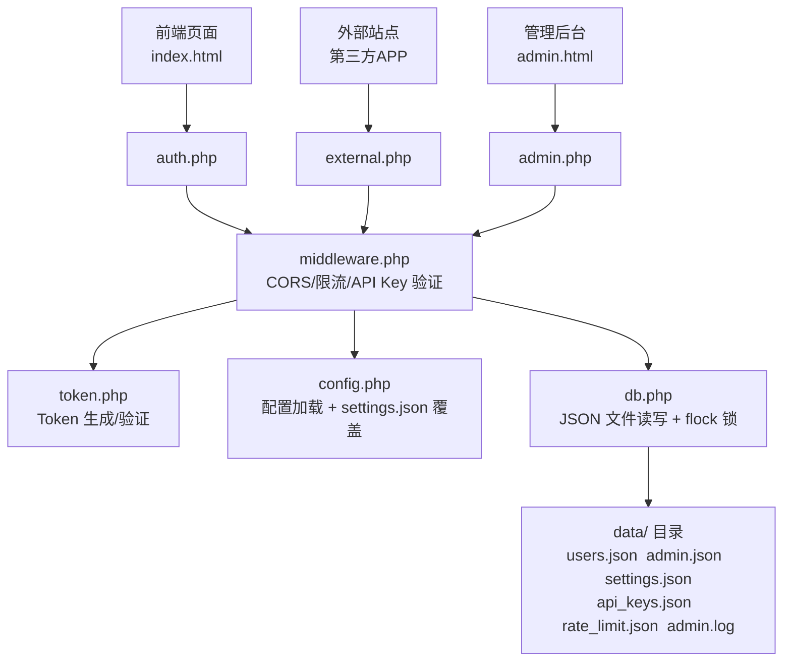
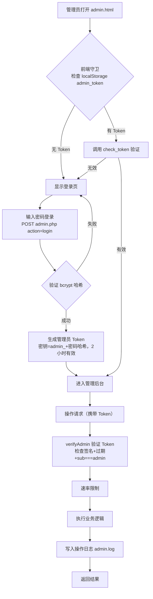
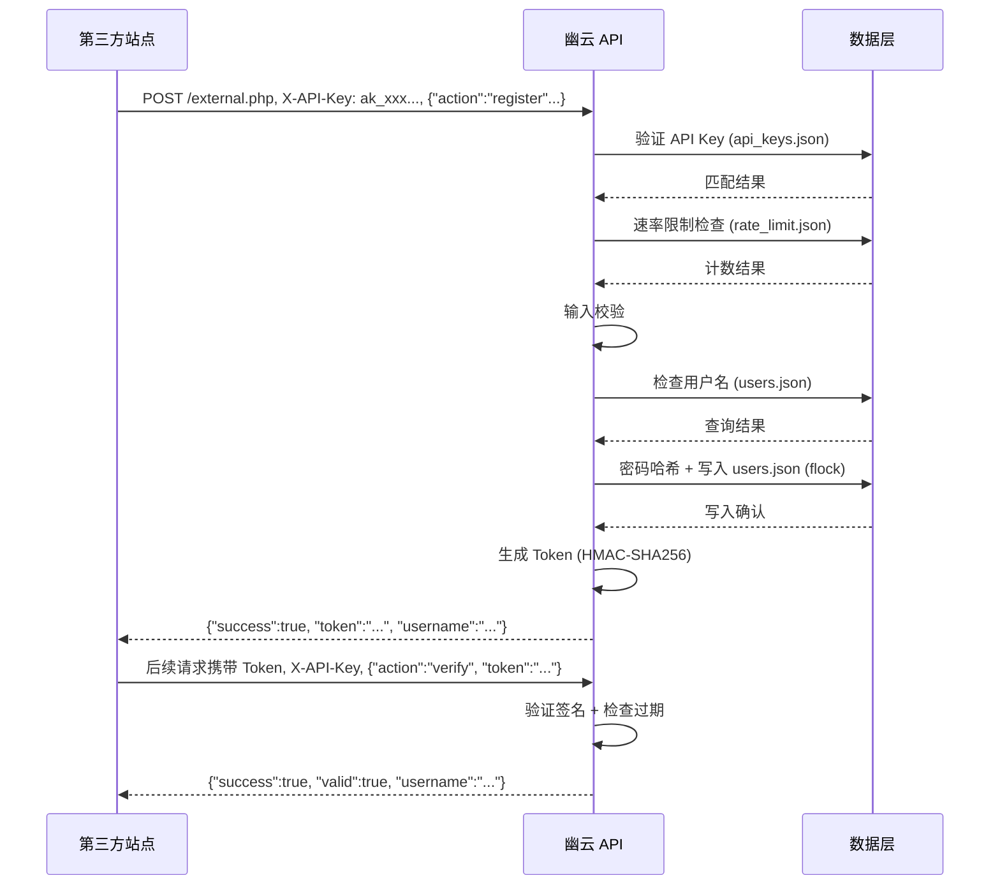
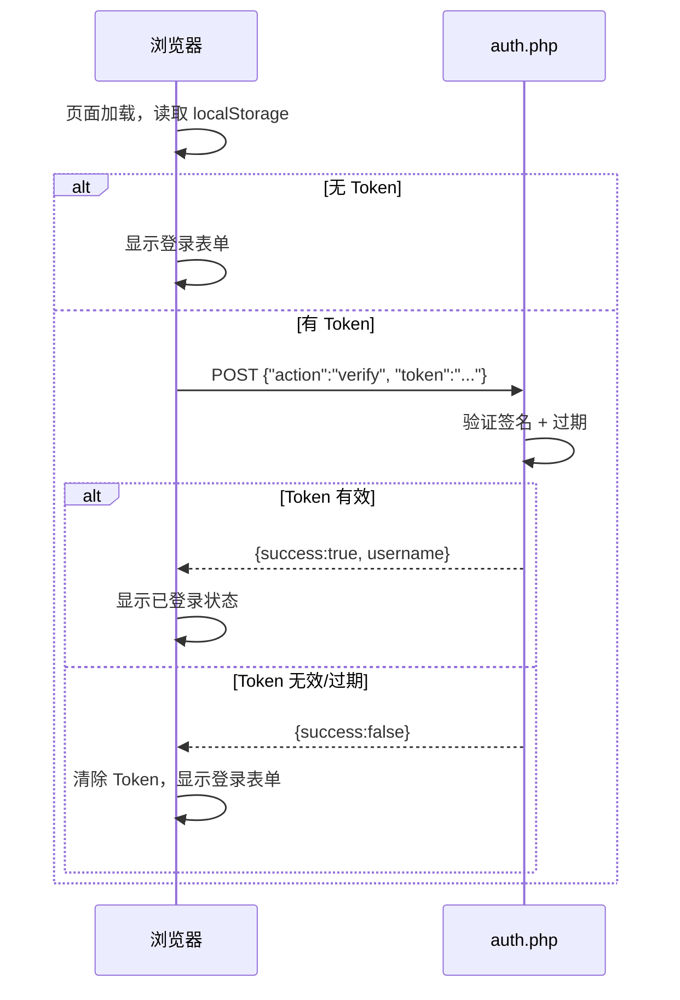

# 幽云用户系统 — API 完整流程文档

> 本文档从架构、数据流、认证机制三个维度，完整描述幽云用户系统 API 的内部工作流程。

---

## 目录

- [系统架构](#系统架构)
- [请求生命周期](#请求生命周期)
- [认证体系](#认证体系)
  - [用户 Token](#用户-token)
  - [API Key](#api-key)
  - [管理员 Token](#管理员-token)
- [数据流详解](#数据流详解)
  - [注册流程](#注册流程)
  - [登录流程](#登录流程)
  - [Token 验证流程](#token-验证流程)
  - [用户名检查流程](#用户名检查流程)
  - [管理员操作流程](#管理员操作流程)
- [安全机制](#安全机制)
- [文件存储结构](#文件存储结构)
- [时序图](#时序图)

---

## 系统架构



---

## 请求生命周期

每个 API 请求经历以下阶段：

```mermaid
flowchart TD
    A[客户端请求] --> B[HTTP 方法检查]
    B -- 非 POST --> B1[405 Method Not Allowed]
    B -- POST --> C[CORS / 安全头设置]
    C --> D[API Key 验证]
    D -- 仅 external.php --> D1{Key 有效?}
    D1 -- 否 --> D2[401 Unauthorized]
    D1 -- 是 --> E[速率限制检查]
    E -- 超限 --> E1[429 Too Many Requests]
    E -- 通过 --> F[JSON Body 解析]
    F -- 格式错误 --> F1[400 Bad Request]
    F -- 成功 --> G[Action 路由分发]
    G --> H[业务逻辑处理<br/>输入校验、数据库操作、Token 签发等]
    H --> I[JSON 响应返回<br/>{success: true/false, ...}]
```

---

## 认证体系

系统有三套独立的认证机制：

### 用户 Token

| 属性 | 说明 |
|------|------|
| **用途** | 前端用户登录状态维持 |
| **算法** | HMAC-SHA256 签名 |
| **结构** | `base64(header).base64(payload).signature` |
| **有效期** | 默认 24 小时（可配置） |
| **存储** | 前端 localStorage |
| **签发** | 注册/登录成功后自动返回 |

**Token 结构：**

```
Header:    {"alg":"HS256","typ":"AUTH"}
Payload:   {"sub":"用户名","iat":签发时间,"exp":过期时间}
Signature: HMAC-SHA256(header.payload, token_secret)
```

**验证流程：**
1. 拆分 Token 为三段
2. 用 `token_secret` 重新计算签名，与 Token 中的签名比对（`hash_equals` 防时序攻击）
3. 解析 Payload，检查 `exp` 是否过期
4. 返回 Payload（含用户名 `sub`）或 `null`

### API Key

| 属性 | 说明 |
|------|------|
| **用途** | 第三方站点调用外部 API 的凭证 |
| **格式** | `ak_` + 48 位十六进制（共 51 字符） |
| **生成** | 管理员后台按平台生成 |
| **传递** | 请求头 `X-API-Key: ak_xxx...` |
| **特性** | 每平台独立，可启用/禁用/重新生成 |

**验证流程：**
1. 读取 `X-API-Key` 请求头
2. 遍历 `data/api_keys.json`，用 `hash_equals` 安全比对
3. 匹配成功且 Key 状态为 `enabled` → 更新 `last_used` 时间戳
4. 向下兼容 `config.php` 中的静态 `api_secret_key`

### 管理员 Token

| 属性 | 说明 |
|------|------|
| **用途** | 管理后台身份验证 |
| **算法** | 同用户 Token（HMAC-SHA256） |
| **有效期** | 2 小时 |
| **密钥** | `admin_` + 管理员密码哈希 |
| **签发** | 管理员密码验证通过后返回 |

> ⚠️ 管理员密码修改后，所有已有 Token 立即失效（密钥变了）。

---

## 数据流详解

### 注册流程

```mermaid
flowchart TD
    A[用户输入用户名 + 密码] --> B[输入校验<br/>用户名: 非空、长度3-32、仅字母/数字/下划线/中文<br/>密码: 非空、长度8-128]
    B --> C{用户名唯一性检查}
    C -- 已存在 --> D[返回错误: 用户名已存在]
    C -- 不存在 --> E[密码哈希<br/>password_hash, BCRYPT, cost=12]
    E --> F[写入 users.json<br/>flock 排他锁，读取→追加→写回→解锁]
    F --> G[生成 Token<br/>Header + Payload + HMAC-SHA256 签名]
    G --> H[返回<br/>{success:true, token, username}]
```

### 登录流程

```mermaid
flowchart TD
    A[用户输入用户名 + 密码] --> B[输入非空校验]
    B --> C{查找用户}
    C -- 不存在 --> D[返回: 用户名或密码错误]
    C -- 存在 --> E{密码验证<br/>password_verify}
    E -- 不匹配 --> D
    E -- 匹配 --> F[更新 last_login 时间戳]
    F --> G[生成 Token]
    G --> H[返回<br/>{success:true, token, username}]
```

### Token 验证流程

```mermaid
flowchart TD
    A[前端读取 localStorage 中的 Token] --> B[POST /api/auth.php<br/>action=verify, token]
    B --> C{token->verify}
    C -- 签名无效/已过期 --> D[返回<br/>{success:false, 消息:Token无效或已过期}]
    C -- 有效 --> E[返回<br/>{success:true, username, expires}]
    D --> F[前端清除 Token，跳转登录]
```

### 用户名检查流程

```mermaid
flowchart TD
    A[外部站点调用 check 接口] --> B[POST /api/external.php<br/>Header: X-API-Key<br/>Body: action=check, username]
    B --> C[API Key 验证 → 速率限制 → 输入校验]
    C --> D{db->userExists?}
    D -- 是 --> E[返回 {success:true, available: false}]
    D -- 否 --> F[返回 {success:true, available: true}]
```

### 管理员操作流程




---

## 安全机制

| 层级 | 措施 | 实现 |
|------|------|------|
| **传输** | CORS 白名单 | `middleware.php` → `allowed_origins` |
| **传输** | 安全响应头 | `X-Content-Type-Options`, `X-Frame-Options`, `no-cache` |
| **认证** | API Key 动态管理 | 按平台生成，支持启用/禁用，`hash_equals` 比对 |
| **认证** | Token HMAC-SHA256 签名 | 防篡改，含过期时间 |
| **认证** | 管理员独立密码 | bcrypt (cost=12)，Token 2 小时过期 |
| **数据** | 密码 bcrypt 哈希 | cost=12，不可逆 |
| **数据** | 文件锁 (flock) | 并发安全读写 |
| **数据** | .htaccess | 禁止 Web 直接访问 .json |
| **防攻击** | 速率限制 | 每 IP 每分钟可配置次数，滑动窗口 |
| **防攻击** | 统一错误消息 | 登录失败不区分用户名/密码，防枚举 |
| **防攻击** | 输入严格校验 | 用户名/密码长度、格式白名单 |
| **防攻击** | 延迟响应 | 用户不存在时也执行一次 `password_verify`，防止通过响应时间判断 |
| **审计** | 操作日志 | 管理员所有操作记录到 `admin.log` |

---

## 文件存储结构

### users.json

```json
{
  "zhangsan": {
    "username": "zhangsan",
    "password": "$2y$12$...（bcrypt 哈希）",
    "created": "2026-05-15T10:00:00+08:00",
    "last_login": "2026-05-15T18:00:00+08:00",
    "banned": false
  }
}
```

> Key 为小写用户名，`username` 字段保留原始大小写。

### api_keys.json

```json
[
  {
    "id": "a1b2c3d4e5f6g7h8",
    "platform": "官方网站",
    "key": "ak_abcdef1234567890...",
    "enabled": true,
    "created": "2026-05-15T10:00:00+08:00",
    "last_used": "2026-05-15T18:00:00+08:00"
  }
]
```

### admin.json

```json
{
  "password": "$2y$12$...（bcrypt 哈希）",
  "created": "2026-05-15T10:00:00+08:00"
}
```

### settings.json

```json
{
  "allowed_origins": ["https://api.yun52.cn"],
  "rate_limit": 30,
  "token_ttl": 86400,
  "username_min": 3,
  "username_max": 32,
  "password_min": 8,
  "password_max": 128
}
```

### admin.log

```
[2026-05-15T10:30:00+08:00] APIKEY_CREATE: 官方网站 (a1b2c3d4) | IP: 1.2.3.4
[2026-05-15T10:35:00+08:00] TOGGLE_BAN: baduser → 已封禁 | IP: 1.2.3.4
[2026-05-15T10:40:00+08:00] SAVE_SETTINGS: rate_limit, token_ttl | IP: 1.2.3.4
```

---

## 时序图

### 完整的第三方站点集成流程



### 前端页面登录状态保持




---

## 错误处理策略

| 场景 | HTTP 状态码 | success 字段 | 设计意图 |
|------|:-----------:|:------------:|----------|
| 方法不允许 | 405 | false | 拒绝非 POST |
| API Key 无效 | 401 | false | 未授权 |
| 频率超限 | 429 | false | 限流保护 |
| JSON 格式错误 | 400 | false | 输入校验 |
| 用户名已存在 | 200 | false | 业务错误 |
| 密码错误 | 200 | false | 统一流报 |
| Token 过期 | 200 | false | 需重新登录 |
| 服务器异常 | 500 | false | 内部错误 |

> 业务层面的失败统一返回 HTTP 200 + `success:false`，只有基础设施层面的错误使用 4xx/5xx。
